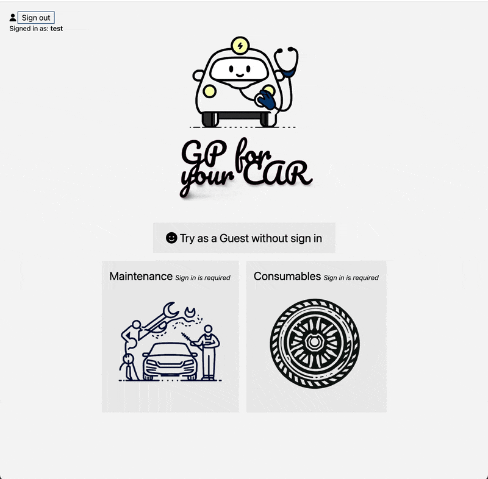

# Car-GP

<b>App to record car's status.</b> 

This project is from my personal experience where I needed assistance with car's status. This app is using similar stack as my previous projects and additionally JWT, and Tailwind styling.

### Goal

Provide useful information for car owners to remind when their car needs attention.

## Demo
Live: https://car-gp.up.railway.app/ 

## Skill

* HTML
* CSS
* JavaScript
* TypeScript
* React
* Drizzle
* SQLite3
* JWT
* Tailwind

## Stretch Goal

App notification(push alarm) function.
